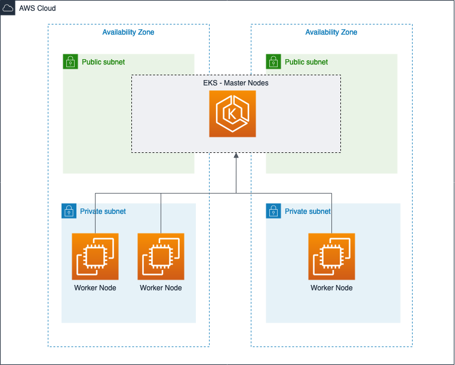

# EKS Cluster Demo

The purpose of this repository is to demonstrate the use of [eksclt](https://eksctl.io) to provision an EKS cluster in high availability within an existing VPC network in your AWS account 

## Prerequisites

* [kubectl](https://kubernetes.io/docs/tasks/tools/install-kubectl/)
* [eksctl](https://docs.aws.amazon.com/eks/latest/userguide/eksctl.html#installing-eksctl)
* [aws-cli](https://docs.aws.amazon.com/pt_br/cli/latest/userguide/cli-chap-install.html)
* Previously configured VPC
* Pre-configured AWS access credentials, [how to configure](https://docs.aws.amazon.com/pt_br/sdk-for-java/v1/developer-guide/setup-credentials.html)
* [cookiecutter](https://cookiecutter.readthedocs.io/en/1.7.0/index.html) to generate the cluster.yaml required to create the cluster using eksclt 

## Creating the cluster prerequisites

In this repository you are going to find an folder called [infraestructure](./infraestructure) and there you will find a CDK template that provision all the cluster needs as AWS IAM Roles and more.

## Creating your first cluster using eksctl

* Criar Amazon EKS service role no console do IAM (https://docs.aws.amazon.com/eks/latest/userguide/getting-started-console.html#role-create), essa role será utilizada posteeriormente.

* Execute o seguinte comando com o cookiecutter para gerar as configurações do seu cluster EKS:
```shell
cookiecutter eks_configs
```

* As seguintes perguntas serão exibidas, após preenche-las uma pasta será criada na raiz do repositório com o nome que você definiu para o cluster, entre nela e siga os passos do README.md.

```
cluster_name [Nome do cluster, ex: poc-cluster]: poc-cluster-test
region [Nome da reigião, ex: us-east-1]: us-east-1
vpc_id [ID da VPC da sua conta, ex: vpc-00000000]: vpc-00000000
vpc_cidr [CIDR da VPC, ex: 10.0.0.0/16]: 10.2.0.0/16
availability_zone_1 [A primeira zona de disponibilidade, ex: us-east-1a]: us-east-1a
availability_zone_2 [A segunda zona de disponibilidade, ex: us-east-1b]: us-east-1b
subnet_priv_1a [O ID da primeira subnet privada, ex: subnet-00000000]: subnet-0000000
subnet_priv_1a_cidr [O CIDR da primeira subnet privada, ex: 10.0.0.0/24]: 10.2.2.0/24
subnet_priv_1b [O ID da segunda subnet privada, ex: subnet-00000000]: subnet-0000000
subnet_priv_1b_cidr [O CIDR da segunda subnet privada: 10.1.0.0/24]: 10.2.3.0/24
subnet_pub_1a [O ID da primeira subnet publica, ex: subnet-00000000]: subnet-000000
subnet_pub_1a_cidr [O CIDR da primeira subnet publica, ex: 10.2.0.0/24]: 10.2.0.0/24
subnet_pub_1b [O ID da segunda subnet publica, ex: subnet-00000000]: subnet-000000
subnet_pub_1b_cidr [O CIDR da segunda subnet publica: 10.3.0.0/24]: 10.2.1.0/24
eks_service_role [O ARN da role criada anteriormente]: 
```


## Cluster architecture that will be provisioned

<p align="center"> 

</p>


## Examples

The **examples/cluster-creation** folder was created to make it easier to understand what will be generated by the cookiecutter with the previously populated values. 

## Example application

A Java application has been developed so that we can test our previously provisioned cluster, this application makes the call to the AWS API using a role with permissions (Permission is done through Kube2Iam) where it lists the contents of a bucket.

Follow the [README] instructions (examples/java-application-example/README.md) to provision it in the cluster

## References

https://github.com/weaveworks/eksctl
https://docs.aws.amazon.com/eks/latest/userguide/getting-started.html
https://github.com/jtblin/kube2iam
https://docs.aws.amazon.com/eks/latest/userguide/cluster-autoscaler.html