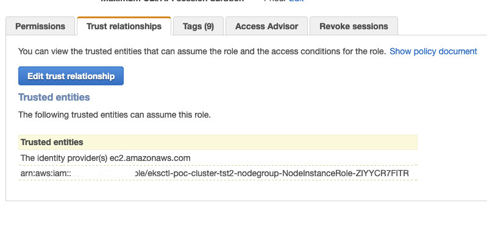

# EKS Cluster Demo

The purpose of this repository is to demonstrate the use of [eksclt](https://eksctl.io) to provision an EKS cluster in high availability in your AWS account with managed node groups.

* This demo was tested in us-east-1 (Viginia) region.

## Prerequisites

* Pre-configured AWS access credentials, [how to configure](https://docs.aws.amazon.com/pt_br/sdk-for-java/v1/developer-guide/setup-credentials.html)
* [kubectl](https://kubernetes.io/docs/tasks/tools/install-kubectl/)
* [eksctl](https://docs.aws.amazon.com/eks/latest/userguide/eksctl.html#installing-eksctl)
* [aws-cli](https://docs.aws.amazon.com/pt_br/cli/latest/userguide/cli-chap-install.html)
* [cookiecutter](https://cookiecutter.readthedocs.io/en/1.7.0/index.html) to generate the cluster.yaml required to create the cluster using eksclt 
* [aws cdk](https://docs.aws.amazon.com/cdk/latest/guide/getting_started.html)

## Creating the cluster prerequisites

In this repository you are going to find an folder called [infraestructure](./infraestructure) and there you will find a CDK template that provision all the cluster needs as AWS IAM Roles and more.

```shell
cdk deploy iam-stack vpc
```

This will create all the AWS components that your EKS cluster will need, eg: **VPC, IAM Roles**

### Outputs:

```
Outputs:
iam-stack.eksrole = arn:aws:iam::xxxxxx:role/eksClusterRoleNew

Outputs:
vpc.VpcID = vpc-xxxxxxxx
vpc.VpcCidr = 10.10.0.0/16
vpc.AvailabilityZones = ['us-east-1a', 'us-east-1b']
vpc.Region = us-east-1
vpc.PublicSubnetsIds = ['subnet-xxxxxxx', 'subnet-xxxxxxx']
vpc.PrivateSubnetsIds = ['subnet-xxxxxxx', 'subnet-xxxxxxx']
```

The above outputs will be used to create you EKS cluster

## Creating your first cluster using eksctl

Now it is time to create you eks cluster template that eksctl will use to create your Kubernetes stack.

* Run the follow command so cookiecutter can create the eks.yaml template:
```shell
cookiecutter eks_configs
```

*  The following questions will be displayed, after filling them a folder will be created at the root of the repository with the name you defined for the cluster.

```
cluster_name [Your cluster name, eg: poc-cluster]: poc-cluster-test
region [Region name to provision, ex: us-east-1]: us-east-1
vpc_id [Your VPC id, eg: vpc-00000000]: vpc-00000000
vpc_cidr [VPC CIDR, eg: 10.10.0.0/16]: 10.2.0.0/16
availability_zone_1 [The first availability zone, eg: us-east-1a]: us-east-1a
availability_zone_2 [The second availability zone, eg: us-east-1b]: us-east-1b
subnet_priv_1a [O ID da primeira subnet privada, ex: subnet-00000000]: subnet-0000000
subnet_priv_1a_cidr [The CIDR of the above subnet, eg: 10.10.2.0/24]: 10.2.2.0/24
subnet_priv_1b [The second private subnet id [us-east-1b], ex: subnet-00000000]: subnet-0000000
subnet_priv_1b_cidr [The CIDR of the above subnet, eg: 10.10.3.0/24]: 10.2.3.0/24
subnet_pub_1a [The first public subnet id [us-east-1a], ex: subnet-00000000]: subnet-000000
subnet_pub_1a_cidr [The CIDR of the above subnet, eg: 10.10.0.0/24]: 10.2.0.0/24
subnet_pub_1b The second public subnet id [us-east-1b], ex: subnet-00000000]: subnet-000000
subnet_pub_1b_cidr [The CIDR of the above subnet, eg: 10.10.1.0/24]: 10.2.1.0/24
eks_service_role [The eks cluster role]: 
```

**eks_service_role**: eks cluster role that CDK created before.

* After the template creation it's time to create our cluster, so run the following command
```shell
eksctl create cluster -f <YOU_CLUSTER_NAME_FOLDER>/cluster-template.yaml
```
It will take some time so be patient

* After the cluster creation it's time to update your locally kubeconfig, run the following command
```shell
aws eks --region <YOUR_REGION> update-kubeconfig --name <YOUR_CLUSTER_NAME>
```

* Go to console and tag your subnets with public and private specific tags, those tags are used for provision public and private Loadbalancers.
```
Private Subnets - kubernetes.io/role/internal-elb: 1
Public Subnets - kubernetes.io/role/elb: 1
```

## Applying extra kubernetes manifest to create useful components

This step is optional but we are going to add some useful features to our cluster, like:

- [Cluster Autoscaler](https://docs.aws.amazon.com/eks/latest/userguide/cluster-autoscaler.html)
- [Kube2Iam](https://github.com/jtblin/kube2iam)
- [Metric Server](https://github.com/kubernetes-sigs/metrics-server)

**TIP**: Every time when **<YOU_CLUSTER_NAME_FOLDER>** appears replace with the folder name that cookiecutter created

**Metric Server**

```shell
kubectl apply -f <YOU_CLUSTER_NAME_FOLDER>/manifests/04-metric-server
```

**Kube2Iam**
```shell
kubectl apply -f <YOU_CLUSTER_NAME_FOLDER>/manifests/02-kube2iam
```

**Cluster Autoscaler**

For Cluster autoscaling creation you need to do a few steps before creation since we are using kube2iam we need to grant permission to the role of the managed nodes.

* Get the managed nodes role.

Replace **<YOUR_CLUSTER_NAME>** with your cluster name

```shell
aws eks describe-nodegroup --cluster-name <YOUR_CLUSTER_NAME> --nodegroup-name app-node-group | jq .nodegroup.nodeRole
```

Go to **<YOU_CLUSTER_NAME_FOLDER>/manifests/08-cluster-autoscaling/cluster_autoscaler.yaml** and replace **<MANAGED_ROLE_ARN>** in  with the role arn that you get above

Now go to AWS console and search for the IAM Role that you get above, go to **trust relashionship** click in **Edit trust relashionship** and place the following content:

```json
{
  "Version": "2012-10-17",
  "Statement": [
    {
      "Effect": "Allow",
      "Principal": {
        "Service": "ec2.amazonaws.com"
      },
      "Action": "sts:AssumeRole"
    },
    {
      "Sid": "",
      "Effect": "Allow",
      "Principal": {
        "AWS": "<MANAGED_ROLE_ARN>"
      },
      "Action": "sts:AssumeRole"
    }
  ]
}
```

This is how it will look like in console.

<p align="center"> 

</p>

* Finally apply the manifest

```shell
kubectl apply -f <YOU_CLUSTER_NAME_FOLDER>/manifests/08-cluster-autoscaling
```

## Cluster architecture that will be provisioned

<p align="center"> 

</p>


## Examples

The **examples/cluster-creation** folder was created to make it easier to understand what will be generated by the cookiecutter with the previously populated values. 

## Example application

A Java application has been developed so that we can test our previously provisioned cluster, this application makes the call to the AWS API using a role with permissions (Permission is done through Kube2Iam) where it lists the contents of a bucket.

Follow the [README](examples/java-application-example/README.md) to provision it in the cluster

## References

https://github.com/weaveworks/eksctl
https://docs.aws.amazon.com/eks/latest/userguide/getting-started.html
https://github.com/jtblin/kube2iam
https://docs.aws.amazon.com/eks/latest/userguide/cluster-autoscaler.html

## Security

See [CONTRIBUTING](CONTRIBUTING.md#security-issue-notifications) for more information.

## License

This library is licensed under the MIT-0 License. See the LICENSE file.
